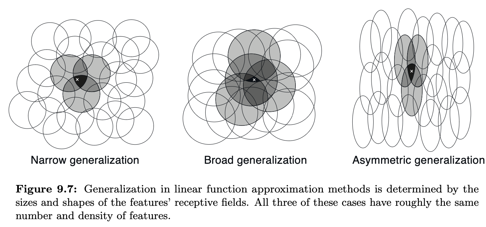
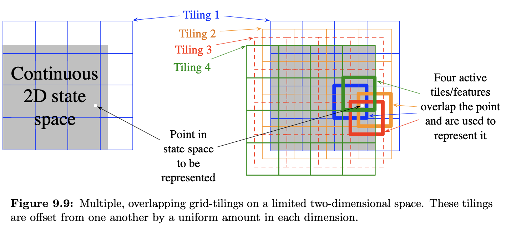
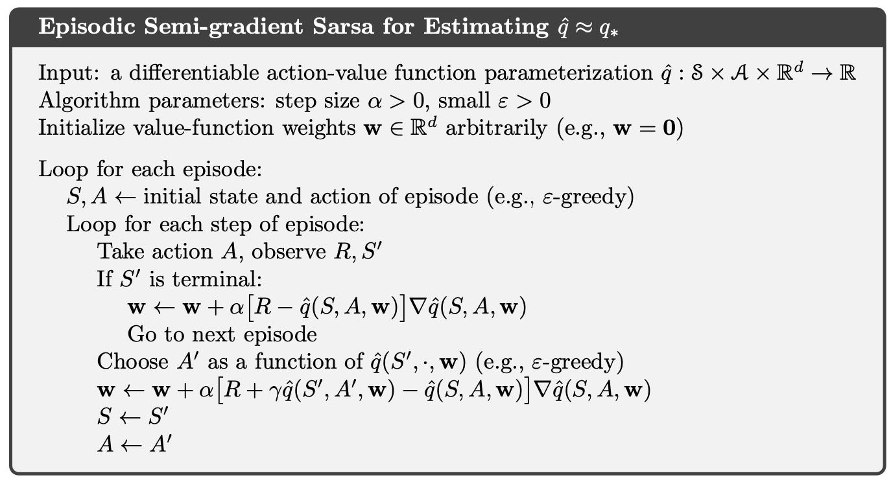
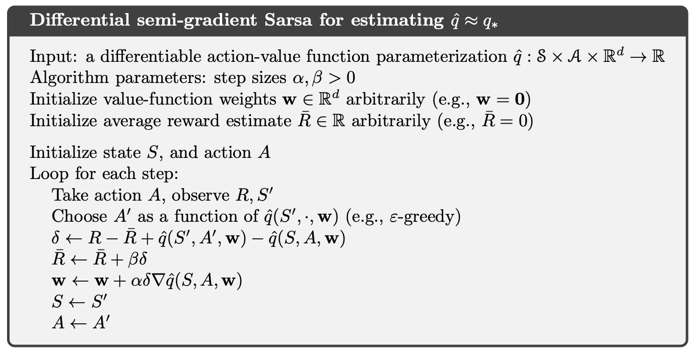

#  The Prediction Objective

In the tabular methods, a continious measure of prediction quality was not necessary because the learned value function would equal the true value function exactly. But with approximation, an update at once state affects many others meaning that it is not possible to get the values of all states exactly correct. We must specifiy a state distrubtion representing how much we care about the error in each state $s$.

$ \mu(s) \ge 0, \sum_{s}\mu(s)=1$

This is how much we care about the error in each state $s$.

With the error in the state $s$, we need to utilize the square of the difference between the approximate value $\hat{v}(s,w)$ and the true value $v_{\pi}(s)$

The Mean Squared Value Error denoted as $\overline{VE}(w)=\sum_{s\in S}\mu(s)[v_{\pi}(s)-\hat{v}(s,w)]^2$

# Linear Methods

One of the most important function approximation is that which the approximation function $\hat{v}(\dot,w)$ is a linear function of the weight vector w. Linear methods approximate state-value function by the innterproduct between the weights $w$ and the feature vector, $x(s)$:

$\hat{v}(s,w)=w^Tx(s)=\sum_{i=1}^{d}w_{t}x_{i}(s)$

The gradient of this with respect to w is:

$\nabla\hat{v}(s,w)=x(s)$

# Coarse Coding
One kind of representation for this case is made up of features corresponding to circles in state space, as shown to the right. If the state is inside a circle, then the corresponding feature has the value 1 and is said to be present; otherwise the feature is 0 and is said to be absent. This kind of 1–0-valued feature is called a binary feature. Given a state, which binary features are present indicate within which circles the state lies, and thus coarsely code for its location. Representing a state with features that overlap in this way (although they need not be circles or binary) is known as coarse coding.

# Tile Coding
Tile coding is a form of coarse coding for multi-dimensional continuous spaces that is flexible and computationally efficient. It may be the most practical feature representation for modern sequential digital computers.

# Stacking Features
In SARSA, we need to move from state-values to action-values. Such as in this example:

$q_{\pi}(s,a)\approx\hat{q}(s,a,w) = w^{T}x(s,a)$

One way to do this is to have a state for each action or also known as **stacking the features**.

Let's assume there are 4 features:

$x(s)=[x_{0}(s),x_{1}(s),x_{2}(s),x_{3}(s)]^T$

With these actions:

$A(s) = {a_{0},a_{1},a_{2}}$

To represent this by learning both the states and actions you can rewrite the states as:

$x(s)=[\color{blue}x_{0}(s),x_{1}(s),x_{2}(s),x_{3}(s),\color{red}x_{0}(s),x_{1}(s),x_{2}(s),x_{3}(s),\color{green}x_{0}(s),x_{1}(s),x_{2}(s),x_{3}(s)\color{black}]^T$ Now the feature vector has 12 components.

# Episode Semi-Gradient Control

The general gradient descent update for action-value prediction is:

$w_{t+1} = w_{t} + \alpha[U_{t}-\hat{q}(S_{t},A_{t},w_{t})]\nabla\hat{q}(S_{t},A_{t},w)$

The update for the one-step Sarsa method is:

$w_{t+1} = w_{t} + \alpha[R_{t+1}+\gamma\hat{q}(S_{t+1},A_{t+1},w_{t+1} - \hat{q}(S_{t},A_{t},w_{t})]\nabla\hat{q}(S_{t},A_{t},w)$

To form control methods, we need to couple such action-value prediction methods with techniques for policy improvement and action selection. Suitable techniques applicable to continuous actions, or to actions from large discrete sets, are a topic of ongoing research with as yet no clear resolution. On the other hand, if the action set is discrete and not too large, then we can use the techniques already developed in previous chapters. That is, for each possible action a available in the current state $S_{t}$, we can compute $\hat{q}(S_{t},a,w_{t})$ and then find the greedy action. Policy improvement is then done (in the on-policy case treated in this chapter) by changing the estimation policy to a soft approximation of the greedy policy such as the "-greedy policy. Actions are selected according to this same policy.

# Expected Sarsa and Q-Learning with Function Approximation

In the regular Sarsa the function approximation was this:

$w \leftarrow w + \alpha(R_{t+1}+\gamma\hat{q}(S_{t+1},A_{t+1},w)-\hat{q}(S_{t},A_{t},w))\nabla\hat{q}(S_{t},A_{t},w)$

To convert this into **expected Sarsa** you sum over the expected values of each action:

$w \leftarrow w + \alpha(R_{t+1}+\gamma\sum_{a'}\pi(a'|S_{t+1})\hat{q}(S_{t+1},a',w)-\hat{q}(S_{t},A_{t},w))\nabla\hat{q}(S_{t},A_{t},w)$

To convert this into the **Q-Learning** you just take the greedy policy or the max:

$w \leftarrow w + \alpha(R_{t+1}+\gamma * max_{a'}\hat{q}(S_{t+1},a',w)-\hat{q}(S_{t},A_{t},w))\nabla\hat{q}(S_{t},A_{t},w)$

# Initialize Values Optimistically

One way to initialize values optimistically under Function Approximation are through theres 2 ways.

Let's say we have a linear function approximation which:
$q_{\pi}(s,a)\approx\hat{q}(s,a,w) = w^{T}x(s,a)$

You can set the $\begin{bmatrix} 100\\ 100\\...\\100\\100\end{bmatrix}$, which you could set it some values that is the largest possible return. Therefore as long as each state has at least one feature that is active, the value will optimistic and likely overly so. However, in non-linear function appriximation such as $q_{\pi}(s,a)\approx\hat{q}(s,a,w) = NN(s,a,w)$ it is complicated to provide optimistic values. There could be situations where you would output negative values even with positive initial weights such as the tanh activation function. 

# Average Reward

Like the discounted setting, the average reward setting applies to continuing problems, problems for which the interaction between agent and environment goes on and on forever without termination or start states. Unlike that setting, however, there is no discounting—the agent cares just as much about delayed rewards as it does about immediate reward. The average-reward setting is one of the major settings commonly considered in the classical theory of dynamic programming and less-commonly in reinforcement learning.

In the average-reward setting, the quality of a policy $\pi$ is defined as the average rate of reward, or simply the average reward, while following that policy which will be denoted as $r(\pi)$:

$r(\pi) = \lim_{h\rightarrow\infty} \frac{1}{h}\sum^{h}_{t=1}E[R_{t} | S_{0},A_{0:t-1}~\pi]$
$=\sum_{s}\mu_{pi}(s)\sum_{a}\pi(a|s)\sum_{s',r}p(s',r|s,a)r$

The differential return is:

$G_{t}=R_{t+1}-r(\pi)+R_{t+2}-r(\pi)+R_{t+3}-r(\pi)+...$

This is an example algorithm that utilizes differential semi-gradient Sarsa.
